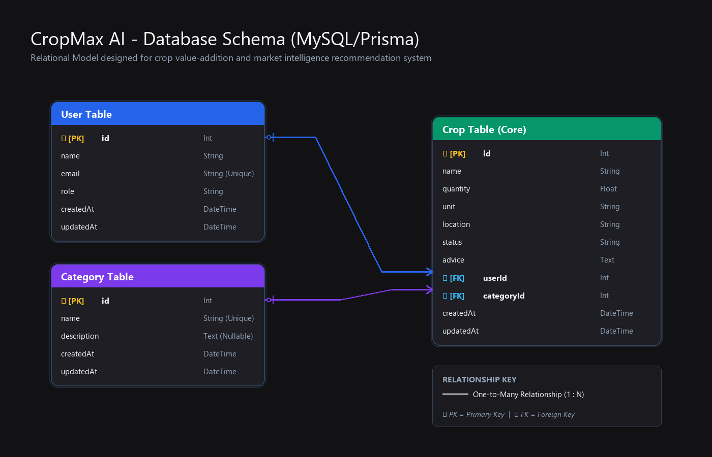

# 🌾 CropMax AI
> AI-Powered Crop Value Addition & Profit Recommendation System

## Problem
Farmers sell crops directly without knowing if processing them could earn more profit.

## Solution
Enter your crop, quantity, and location — CropMax AI recommends whether to sell raw,
process into products (juice, pickle, flour), or wait for better prices.

## Features
- 👨‍🌾 Farmer Dashboard — register, add crops, track recommendations
- 📊 Market Analysis — live prices, demand trends
- 💰 Profit Calculator — compare raw vs processed earnings
- 📈 Price Prediction — forecast best time to sell
- 🤖 AI Recommendations — powered by OpenAI GPT-4o

## Tech Stack
| Layer      | Technology            |
|------------|-----------------------|
| Frontend   | React + Next.js       |
| Styling    | Tailwind CSS          |
| Backend    | Node.js + Express.js  |
| Database   | MySQL                 |
| ORM        | Prisma                |
| AI         | OpenAI API (GPT-4o)   |
| Deployment | Vercel + Render       |

---

## Database Architecture & Schema Diagram

### Database Choice: MySQL (via Prisma ORM)
For **CropMax AI**, we chose **MySQL** as our core database. The application's data model contains highly structured entities with clear relational dependencies:
1. **User**: Represents farmers using the application.
2. **Category**: Represents crop types (e.g., Grains, Vegetables, Fruits) for sorting and rules.
3. **Crop**: Holds harvest quantities, locations, and the generated AI recommendation status/advice.

A relational database is optimal here because it guarantees **referential integrity** (e.g., deleting a user automatically cascades and cleans up their crop records) and allows robust query performance on structured fields (like searching by crop name or location). Using **Prisma ORM** provides type safety, autogenerated migrations, and a clean declarative schema.

### Schema Diagram
Below is the visual entity-relationship diagram for CropMax AI:



---

## Development Setup & Installation

### Backend Database Setup & Migrations
Before running the application, you must configure and run the MySQL database.

1. **Prerequisites**: Ensure you have MySQL Server installed and running locally.
2. **Create Database**: Create a database named `cropmax_ai` in your MySQL instance:
   ```sql
   CREATE DATABASE cropmax_ai;
   ```
3. **Environment Variables**: Create a `.env` file in the `backend` directory (copy from `backend/.env.example`) and configure your MySQL connection string:
   ```env
   PORT=5000
   NODE_ENV=development
   FRONTEND_URL=http://localhost:3000
   DATABASE_URL="mysql://<username>:<password>@localhost:3306/cropmax_ai"
   ```
4. **Install Dependencies & Migrate**:
   Install the node packages in the `backend` folder and run the Prisma migrations:
   ```bash
   cd backend
   npm install
   npx prisma migrate dev --name init
   ```
5. **Seeding Default Data**: The backend automatically seeds a default User (`farmer.john@cropmax.ai`), default Category (`General`), and default crop recommendations (Mango, Tomato) into MySQL on initial database connection.

### Run the Application

#### 📡 Start the Backend API
From the `backend` directory, run:
```bash
npm run dev
```
The server will start on [http://localhost:5000](http://localhost:5000) and verify the MySQL connection.

#### 💻 Start the Frontend Client
From the root workspace directory, install dependencies and run:
```bash
npm install
npm run dev
```
Open [http://localhost:3000](http://localhost:3000) in your browser to view the application dashboard.

---

## Frontend Core Components built:
- **Navbar**: Responsive global header with navigation links and profile avatar.
- **Hero Section**: Aesthetic banner displaying the pitch, key features, and dynamic mockup dashboard charts.
- **Crop Card**: Reusable product card accepting badges, status alerts, and customized call-to-actions.
- **Footer**: Structured platform directories, support details, and responsive social tags.
